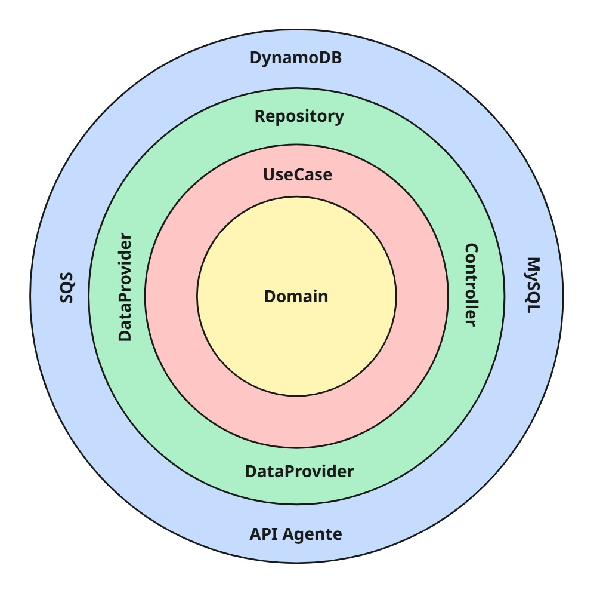

# Cotalizer – API Chatbot

---

> Uma das API REST do LeadFlow: Lógica de chatbot integrado a agente de IA e Whatsapp
> 

## Sumário

---

## Visão Geral

API responsável pela lógica de chatbot do projeto

- Recebe mensagens e enviar para o agente
- Recebe resposta do agente e continua/finaliza conversa

---

## Arquitetura & Domínio

### Estilo arquitetural

- **Clean Architecture** (camadas: EntryPoint → Application → Infrastructure → Domain). O diagrama de camadas está no repositório (veja `docs/arquitetura.jpg`).

**EntryPoint**

- Controllers, DTOs e mappers.

**Application**

- Use cases, gateways (ports), exceções de aplicação.

**Infrastructure**

- Data providers (integração externa com SQS), mappers, repositories (MySQL, DynamoDB), security.

**Domain**

- Entidades/domínios puros (sem dependências de frameworks).

### Domínios principais

- **Cliente**: Usuário do projeto por completo.
- **Contexto**: Contexto criado para mensagen do chatbot
- **Mensagem**: Mensagem recebida dos usuários do cliente.

> Dica visual rápida:
> 



---

## Infraestrutura

- **Hospedagem**: AWS (PaaS) – disponibilidade diária.
- **Persistência**: MySQL + DynamoDB
- **Cache/Filas**: SQS
- **Autenticação**: JWT + API Key

---

## Tecnologias & Dependências

- **Linguagem/Framework**: Java 21, Spring Boot 3.5 (Web, Validation, Cloud AWS (S3 e DynamoDB), Data )
- **Cloud**: AWS SDK v2 (S3)
- **Testes**: JUnit 5, Mockito, Spring Security Test, JaCoCo
- **Outras**: Lombok, Hibernate Validator

> A lista completa está no pom.xml.
> 

---

## Como Rodar Localmente

**Pré-requisitos**

- Java 17
- Maven 3.9+
- DynamoDB e SQS em execução (LocalStack ou AWS mesmo)
- MySQL

**1) Subir dependências com Docker (exemplo)**

```yaml
version: "3.8"

services:
  localstack:
    image: localstack/localstack:3
    container_name: localstack
    ports:
      - "4566:4566"         # Edge: todos os serviços (SQS/DynamoDB via 4566)
    environment:
      - SERVICES=sqs,dynamodb
      - DEBUG=1
      - DEFAULT_REGION=us-east-1
      - AWS_ACCESS_KEY_ID=test
      - AWS_SECRET_ACCESS_KEY=test
    volumes:
      - "localstack_data:/var/lib/localstack"
      - "/var/run/docker.sock:/var/run/docker.sock" # opcional

  mysql:
    image: mysql:8.4
    container_name: mysql
    ports:
      - "3306:3306"
    environment:
      MYSQL_ROOT_PASSWORD: root
      MYSQL_DATABASE: appdb
      MYSQL_USER: app
      MYSQL_PASSWORD: app
    command: >
      --default-authentication-plugin=mysql_native_password
      --character-set-server=utf8mb4
      --collation-server=utf8mb4_unicode_ci
    healthcheck:
      test: ["CMD", "mysqladmin", "ping", "-h", "127.0.0.1", "-p${MYSQL_ROOT_PASSWORD}"]
      interval: 5s
      timeout: 5s
      retries: 20
    volumes:
      - mysql_data:/var/lib/mysql

  adminer:
    image: adminer:latest
    container_name: adminer
    ports:
      - "8081:8080"
    depends_on:
      - mysql

  # Cria recursos SQS/DynamoDB automaticamente no LocalStack
  init-aws:
    image: amazon/aws-cli:2.17.35
    container_name: init-aws
    depends_on:
      - localstack
    environment:
      - AWS_ACCESS_KEY_ID=test
      - AWS_SECRET_ACCESS_KEY=test
      - AWS_DEFAULT_REGION=us-east-1
    entrypoint: ["/bin/sh","-c"]
    command: >
      "
      echo 'Aguardando LocalStack...';
      until aws --endpoint-url=http://localstack:4566 sqs list-queues >/dev/null 2>&1; do
        sleep 2;
      done;
      echo 'Criando fila SQS...';
      aws --endpoint-url=http://localstack:4566 sqs create-queue --queue-name minha-fila-dev || true;

      echo 'Criando tabela DynamoDB...';
      aws --endpoint-url=http://localstack:4566 dynamodb create-table
        --table-name minha-tabela
        --attribute-definitions AttributeName=id,AttributeType=S
        --key-schema AttributeName=id,KeyType=HASH
        --billing-mode PAY_PER_REQUEST || true;

      echo 'Recursos AWS locais prontos.';
      "
    restart: "no"

volumes:
  localstack_data:
  mysql_data:
  
```

**2) Configurar .env/application.properties**

Aponte o S3 para o MinIO (endpoint override) ou use AWS real.

**3) Run**

```bash
mvn clean spring-boot:run

```

**4) Testes & cobertura**

```bash
mvn -q -DskipTests=false test
open target/site/jacoco/index.html

```

---

## Testes, Qualidade & Segurança

- **Testes**: JUnit 5 + Mockito; cobertura com JaCoCo.
- **Números atuais** (exemplo do último relatório):
    - **Classes**: 98%
    - **Métodos**: 99%
    - **Linhas**: 97%
    - **Branch**: 86%

**Autenticação e segurança**

- **Segredos**: 100% via variáveis de ambiente/profiles (dev vs prod).

---

## Observabilidade

- **Logs estruturados** (SLF4J):
    - erros em *data providers* para falhas externas.
    - info nos principais *use cases* (Contexto, ProcessamentoMensagem, Mensagem).

---

## API & Contratos

- Integrações externas:
    - Z-API

**Padrão de resposta (exemplo)**

```json
{
  "dado": { /* payload */ },
  "erro": null
}

```

**Fluxos chave**

- `/login` → Autenticação do usuário

---

## Licença / Uso

Este repositório é **proprietário** e destinado a uso interno do Cotalizer.

**Não** é liberado para uso, cópia, modificação ou distribuição por terceiros sem autorização expressa.

```
Copyright (c) 2025 Cotalizer.
Todos os direitos reservados.

```